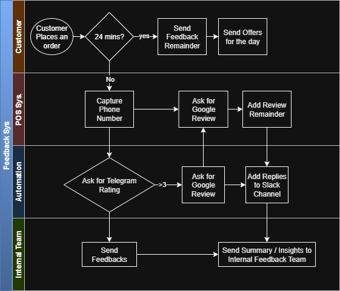

# Feedback Management Solution PoC for Offline Food Brands

This Proof of Concept (PoC) outlines a system designed to automate feedback collection, online review generation, and internal reporting for offline food brands like Mumbai Pav Co. The solution leverages Telegram for customer interaction and Supabase for data management, aiming to streamline the feedback process and enhance customer engagement.

### Workflow Diagram

## Key Components/Technologies

*   **Supabase:** Backend-as-a-Service for database (PostgreSQL), authentication, and real-time capabilities.
*   **Telegram Bot API:** For sending automated messages, receiving user input (ratings, feedback), and managing conversations.
*   **Serverless Functions (e.g., Supabase Functions/Edge Functions, AWS Lambda, Google Cloud Functions):** To handle scheduled tasks (e.g., sending reminders, generating summaries), process Telegram webhook events, and interact with external APIs.
*   **Slack API:** For sending internal notifications (feedback, auto-replies, summaries) to MPC's Slack channel.
*   **Google My Business API:** To fetch Google reviews and potentially post auto-replies (requires specific permissions and setup).
*   **PoS System Integration:** API endpoint within the PoS system to send customer phone numbers to Supabase.

## Supabase Schema Reference

The Supabase schema, previously defined, will be utilized to store customer information, feedback ratings, review links, and other relevant data. This includes tables for `customers`, `feedbacks`, `outlets`, and potentially `telegram_messages` to track message history and status.

## PoC Implementation Steps

The following steps detail the implementation of the feedback management workflow:

### 1. Customer Phone Number Capture & Supabase Integration

*   **Implementation:**
    *   Develop a simple API endpoint within the PoS system (or simulate it) that captures the customer's phone number after an order.
    *   This endpoint will then call a Supabase Edge Function (or a dedicated API Gateway endpoint triggering a serverless function) to insert the customer's phone number and order details into the `customers` table in Supabase.
*   **Technologies:** PoS System (simulated), Supabase Edge Functions, Supabase Database.
*   **Considerations:** Ensure secure transmission of phone numbers. Implement basic validation for phone number format.

### 2. Automated Telegram Message Sending (Initial & Reminders)

*   **Implementation:**
    *   Create a Supabase database trigger or a scheduled Supabase Edge Function that runs periodically (e.g., every minute).
    *   This function will query the `customers` table for new entries that haven't received an initial feedback message and are older than 24 minutes.
    *   It will then use the Telegram Bot API to send a feedback request message to the customer's registered Telegram number.
    *   Implement logic for Day 2 and Day 7 reminders: the scheduled function will check for customers who haven't submitted feedback and send reminder messages.
*   **Technologies:** Supabase Database (triggers), Supabase Edge Functions, Telegram Bot API.
*   **Considerations:** Handle rate limits for Telegram API. Store message sent status and timestamps in Supabase to avoid duplicate messages.

### 3. User Rating Submission on Telegram & Feedback Capture

*   **Implementation:**
    *   **Logic for User Rating:** When the initial Telegram message is sent, it will include inline keyboard buttons for ratings (e.g., 1, 2, 3, 4, 5).
    *   Set up a Telegram webhook that points to a Supabase Edge Function.
    *   When a user clicks a rating button, the webhook will trigger the Edge Function.
    *   The Edge Function will parse the rating from the Telegram update, update the `feedbacks` table in Supabase with the rating, and then prompt the user for detailed feedback (e.g., "Thank you for your rating! Please share your detailed feedback.").
    *   Subsequent user messages will be captured as detailed feedback and associated with the initial rating in the `feedbacks` table.
*   **Technologies:** Telegram Bot API (inline keyboards, webhooks), Supabase Edge Functions, Supabase Database.
*   **Considerations:** Implement robust error handling for Telegram webhook. Ensure proper association of detailed feedback with the correct rating and customer.

### 4. Google Review Request & Reminders (for 4-5 Star Ratings)

*   **Implementation:**
    *   After a 4-5 star rating is submitted, the Supabase Edge Function (from step 3) will generate a custom Google review link (e.g., pre-filled with outlet details) and send it to the user via Telegram.
    *   Implement a scheduled Supabase Edge Function to check for customers who received a review link but haven't clicked it after a certain period. Send reminder messages via Telegram.
*   **Technologies:** Supabase Edge Functions, Telegram Bot API, Google My Business API (for generating review links, if dynamic generation is needed, otherwise static links can be used).
*   **Considerations:** How to track if a user has "clicked" the link (e.g., by redirecting through a tracking URL). Google My Business API access and permissions.

### 5. Automatic Google Review Reply & Slack Notification

*   **Implementation:**
    *   A scheduled Supabase Edge Function will periodically poll the Google My Business API for new reviews for MPC's locations.
    *   Upon detecting a new review, the Edge Function will use the Google My Business API to post an automatic reply (e.g., "Thank you for your feedback!").
    *   The user review and the auto-reply will then be sent to MPC's Internal Slack Channel "Feedbacks" using the Slack API.
*   **Technologies:** Supabase Edge Functions, Google My Business API, Slack API.
*   **Considerations:** Google My Business API authentication and permissions. Define a set of auto-reply templates.

### 6. Offer Message for Low Ratings (1-3 Stars)

*   **Implementation:**
    *   After a 1-3 star rating is submitted, the Supabase Edge Function (from step 3) will schedule an offer message to be sent on Day X (e.g., Day 3).
    *   A scheduled Supabase Edge Function will send a Telegram message with a special offer to these customers.
*   **Technologies:** Supabase Edge Functions, Telegram Bot API.
*   **Considerations:** Define the offer strategy and content.

### 7. Daily Feedback Summary & Insights Generation

*   **Implementation:**
    *   A daily scheduled Supabase Edge Function will query the `feedbacks` table.
    *   It will generate a summary and insights from 1-3 star feedbacks (e.g., common keywords, sentiment analysis if advanced).
    *   This summary will be sent to MPC's Internal Slack Channel "Feedbacks" and relevant email addresses using the Slack API and an email service (e.g., SendGrid, Postmark, or a simple SMTP client).
*   **Technologies:** Supabase Edge Functions, Supabase Database, Slack API, Email Service (e.g., SendGrid).
*   **Considerations:** Define what constitutes "summary & insights." Basic keyword extraction or simple aggregation can be a good starting point for PoC.

## Future Enhancements (Beyond PoC)

*   **Advanced Sentiment Analysis:** Implement more sophisticated natural language processing (NLP) to extract deeper insights from detailed feedback.
*   **Customizable Campaigns:** Allow marketing teams to create and manage different offer campaigns for low-rated customers.
*   **Multi-channel Support:** Extend feedback collection and communication to other platforms (e.g., SMS, in-app).
*   **Outlet-Specific Analytics:** Provide detailed feedback analytics per outlet, allowing managers to identify specific areas for improvement.
*   **CRM Integration:** Integrate with existing CRM systems to enrich customer profiles with feedback data.
*   **A/B Testing for Messages:** Test different message contents and timings for feedback requests and reminders to optimize engagement.
*   **Admin Dashboard:** A web-based dashboard for MPC's internal team to view feedback, manage offers, and configure settings.